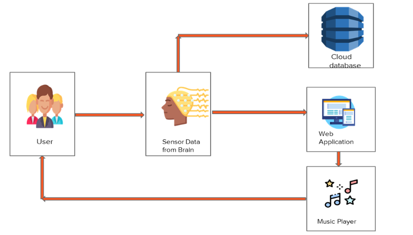
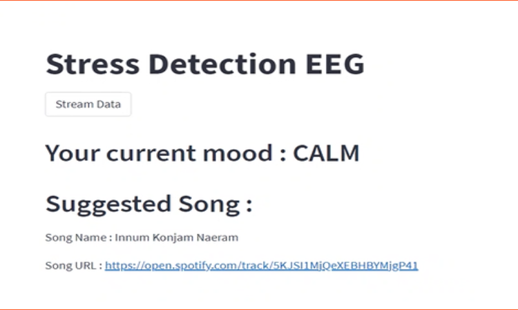

# Stress Detection and Music Recommendation with a Brain Computer Interface (BCI)
Most people face stress at some point in their lives, whether it be physical or emotional. Stress has a negative impact on a person's health. Since, research on stress is still in its infancy, and over the past 10 years, much focus has been placed on the identification and classification of stress. We presented an end-to-end solution for detection of stress from EEG signals collected from an OpenBCI Ganglion EEG Headset. We examined an LSTM and GRU model for classifying stress. We showcase a simple music recommendation system using the Spotify API to play music based on the user's current mood. We also present two architectures to scale this application for large scale use.

## Hardware Components
The following components were required for the setup 
1. OpenBCI Ganglion 4-channel EEG Headset
2. Electrode wires
3. Gel electrode stickers
4. Duracell AA Batteries

2 electrodes of OpenBCI Ganglion were used as reference and ground placed on both earlobes. The other 4 electrodes were placed on location TP9, AF7, AF7, TP10, as per the 10-20 system of electrode placement. 

## Software System Diagram

## Implementation

## References
1. https://github.com/jordan-bird/eeg-feature-generation
2. https://brainflow.org/
3. https://streamlit.io/
4. https://www.kaggle.com/datasets/birdy654/eeg-brainwave-dataset-feeling-emotions

